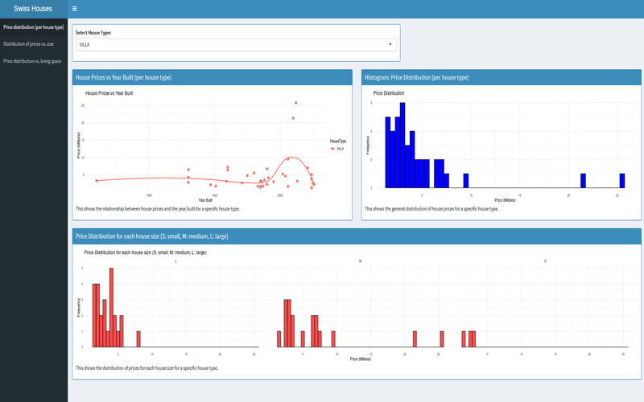

# Swiss Houses Dashboard

An interactive R Shiny dashboard analyzing Swiss real estate data. Features include:
- Price distribution analysis by property type and region
- Living space vs. price correlations
- Geographic price variations
- Property features impact analysis

Built with R Shiny and Docker for easy deployment.

## Dashboard Demo


The dataset used in this project is sourced from Kaggle: https://www.kaggle.com/datasets/etiennekaiser/switzerland-house-price-prediction-data


## Project Structure

### Explanation:
- **app.R**: Main Shiny app code that sources the UI and server components and runs the application.
- **data/**: Directory containing data files.
- **www/**: Directory containing static files (e.g., custom CSS).
- **R/**: Directory containing R scripts for UI, server, data importation, processing, and helper functions.

## Setup

1. **Clone the repository**:
   ```sh
   git clone https://github.com/yourusername/swiss-houses-dashboard.git

2. **Install the required R packages**:
    ```sh
    install.packages(c("shiny", "shinydashboard", "ggplot2", "dplyr", "here"))
    ```
3. **Run the Shiny app**:
    - Open R or RStudio.
    - Set the working directory to the root of the project with
     ```sh
     setwd(path_of_the_project)
    ```
    - Run the application:
    ```sh
    shiny::runApp()
    ```
### Docker Deployment

#### First-time Setup
1. **Navigate to the project directory**:
   

2. **Build the Docker image**:
   ```sh
   docker build -t swiss-houses-dashboard .
   ```

3. **Run the Docker container**:
   ```sh
   docker run -d -p 3838:3838 swiss-houses-dashboard
   ```
#### Subsequent Runs
1. **Start Docker Desktop**

2. **Check if the container is running**:
   ```sh
   docker ps
   ```

3. **If not running, start the container**:
   ```sh
   docker run -d -p 3838:3838 swiss-houses-dashboard
   ```

4. **Access the Dashboard**:
   Open your web browser and navigate to `http://localhost:3838`


